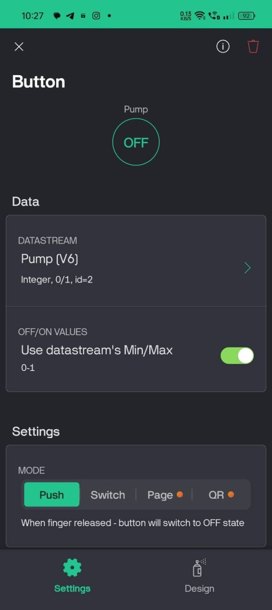

# IoT-Smart-agriculture-System
<h2>Project description</h2>

This project presents a Smart Irrigation System utilizing the ESP32 microcontroller, a soil moisture sensor, and the Blynk IoT platform to deliver an efficient, data-driven solution for agricultural water management. In response to global water scarcity and the need for sustainable farming practices, this system monitors soil moisture levels in real-time and uses the Blynk app to notify farmers when irrigation is necessary. By providing instant, remote alerts, the system enables targeted irrigation, ensuring that crops receive water precisely when required. This approach conserves water, minimizes waste, and promotes optimal plant health.
The integration with the Blynk IoT platform offers additional benefits, allowing farmers to monitor soil conditions from any location, improving operational flexibility and reducing the need for on-site supervision. Designed with scalability and affordability in mind, the system is accessible to a range of agricultural operations, from small farms to large-scale farms.
This project aligns with the United Nations’ Sustainable Development Goals (SDGs), particularly SDG 6 (Clean Water and Sanitation) and SDG 13 (Climate Action), by advancing responsible water usage and reducing the environmental footprint of irrigation practices. Through the use of readily available components and intuitive IoT technology, this system contributes to sustainable agriculture, helping farmers address water challenges while supporting climate resilience and resource conservation.

